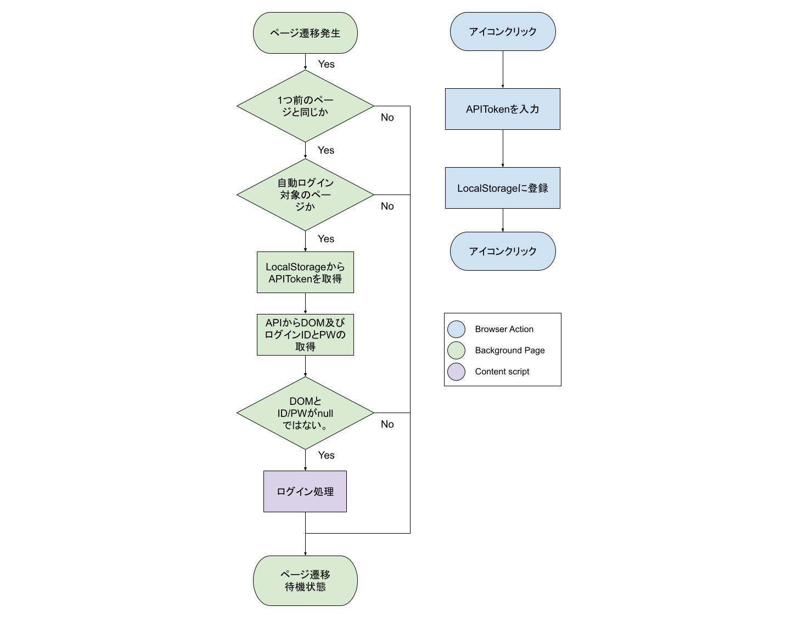

# chrome 拡張機能 仕様について

## 拡張機能に関する概念

- Browser Action  
  URL バー右の拡張機能のアイコンをクリックしたときに実行される。
  ポップアップ UI を表示したり、アイコンクリックをトリガーにスクリプト実行をすることができる。

- Background Page  
  ブラウザの背後で実行されているスクリプトである。

- content script  
  ブラウザ上で表示されているページに対してスクリプトを実行する事ができる。
  DOM 操作はこれを用いて行う。表示されているページの DOM 操作はむしろ content script でしか出来ないことに注意。

## 動作フロー

### フローチャート

### Browser Action

API に登録されている、ユーザーを特定するためのトークンを拡張機能にセットする。

### Background Page

1. ブラウザ起動時に`background.js`を実行。  
   自動ログイン対象の URL を`REGISTERED_URL`に格納する。

2. `chrome.tabs.onUpdated.addListener`によってページが切り替わるたびにコールバック関数を実行する。

#### `chrome.tabs.onUpdated.addListener`のコールバック関数の動作

1. `isReaccess(url)`: 再アクセスか判定する。ログイン失敗時に再ログイン繰り返す挙動を防ぐ。
2. `isUnregistered(url)`: アクセスした Website が自動ログイン対象か判定。
3. `login(tab, url)`: ログイン処理をおこなう。

#### `login()`の動作

1. `localStorage.getItem`: localStorage に格納されたアクセストークンを取得。Token は GraphQL 上でユーザーを特定するためのものである。
2. `getloginDom`: loginDom を取得する。
3. `getCredential`: credential(ログイン先のユーザー ID とパスワード)を取得する。
4. `chrome.tabs.sendMessage()`: loginDom と credential を content script に送信。

### content script

1. `chrome.runtime.onMessage.addListner`: `background.js`から Message を受け取ったときに発火する。
2. コールバック関数では`background.js`loginDom に格納された XPath を元に Dom を取得して、各 input 要素を埋め、送信ボタンをクリックする。

## 開発方法

### 拡張機能の実行手順

1. ブラウザで`chrome://extensions/`にアクセス。
2. 画面右上のスイッチをクリックし、デベロッパーモードを有効にする。
3. 画面左上のパッケージ化されていない拡張機能を読み込むをクリック。
4. 本レポジトリの`chrome-extension`ディレクトリを選択する。
5. 拡張機能が追加されれば成功。

### デバッグ方法

#### background page

1. ブラウザで`chrome://extensions/`にアクセス。
2. 拡張機能の`ビューを検証 バックグラウンドページ`をクリック。
3. DevTools が起動する。

#### browser action(popup)

1. ブラウザのアドレスバー右にある拡張機能のアイコン右クリック。
2. `ポップアップを検証`をクリック。
3. DevTools が起動する。

#### content script

`Chromeメニュー -> 表示 -> 開発 / 管理 -> デベロッパーツール`
から DevTools を起動する。
