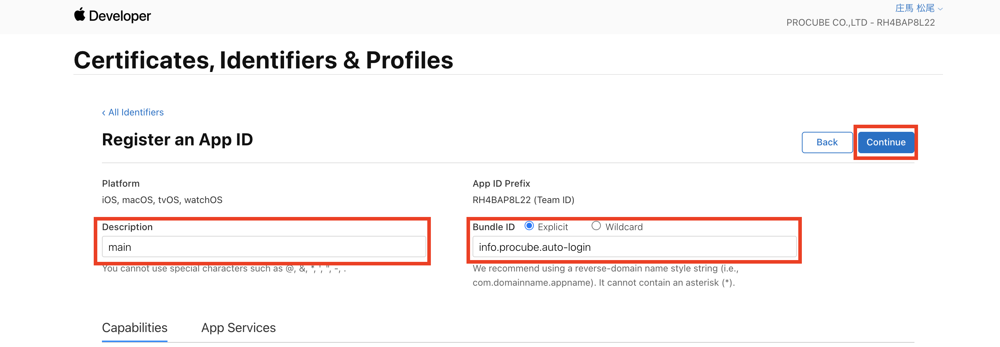
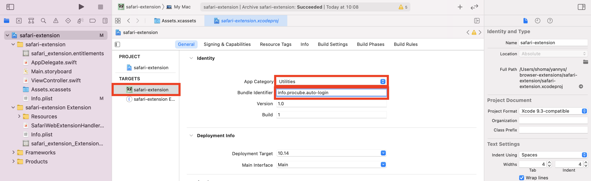
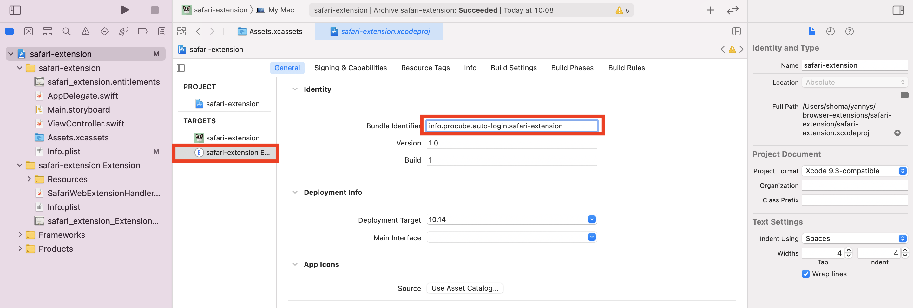

# Chrome,Edge,Firefox,Safari　配布方法

### Chrome拡張機能　ストア公開手順
1. manifestファイルを含めた拡張機能のファイルをzip化する
2. 開発アカウントを作成する
   1. [開発者コンソール](https://chrome.google.com/webstore/devconsole/register)にアクセスし、アカウントを登録する。
3. zipファイルをアップロードする
   1. [開発者コンソール](https://chrome.google.com/webstore/devconsole/register)に2で作成したアカウントでログインする
   2. 「新しくアイテムを追加する」をクリックする
   3. 「拡張機能またはアプリ(.zipファイル)をアップロード」の項目の中の「ファイルを選択」をクリックします
   4. 1で作成したzipファイルを選択する
   5. アップロードをクリック
4. アイコンを設定する
   1. ダッシュボードから128×128サイズのアイコン画像を用意し設定する
5. 公開設定オプションを設定する
   1. 「公開」にチェックし「変更を公開」をクリックする

### Edge拡張機能　ストア公開手順
1. Microsoft Edge 拡張機能開発者として登録する
   1. [Microsoft|アカウント](https://account.microsoft.com/account)に移動しアカウントを作成する
   2. [開発者ページ](https://partner.microsoft.com/dashboard/microsoftedge/public/login?ref=dd)に移動し、サインインし、登録フォームを入力する
2. 拡張機能を Microsoft Edge アドオンストアに提出する
   1. [Microsoft Partner Center](https://partner.microsoft.com/en-us/dashboard/microsoftedge/overview)から画面中央部の`Create new extension`をクリック
   2. 画面中央部の`Browse your files`をクリック
   3. 拡張機能のファイルをzip化したものをアップロードする
   4. ストア情報の詳細を追加
   5. `Submit your extension`から公開する

### Safari extensions Appstore公開手順
1. 開発アカウントを作成する
   1. [AppStoreConnect](https://appstoreconnect.apple.com/login)にアクセスし、アカウントを登録する
2. Bundle IDとAppの作成
   1. [identifierの設定ページ](https://developer.apple.com/account/resources/identifiers/list)にアクセスし、`register an App ID`をクリックします。
   
   2. `App IDs`にチェックし、`Continue`をクリックします。
   
   3. `App`を選択し`Continue`をクリックします。
   
   4. `Description`と`Bundle ID`を設定し、`Continue`をクリックします。
   上記の手順で、以下の画像を参考にメイン用のBundleIDとextension用のBundleIDを作成します。
   
   
3. 新規Appの作成
   1. [AppStoreConnect](https://appstoreconnect.apple.com/)にアクセスし、`マイApp`から「App」の＋ボタンをクリックし`新規App`をクリックします。
   
   
   2. プラットフォーム、会社名、名前、プライマリ言語、バンドルID(2-ivで設定したメイン用のBundleID)、SKU(任意の文字列)、ユーザーアクセスを入力し、`作成`をクリックします。
4. アップロード
   1. safari-extension/safari-extension.xcodeprojをxcodeで開き、`TARGETS`から`safari-extension`を選択し`App Category`を設定します。`Bundle Identifier`は2-ivで作成したメインの`「info.procube.auto-login」`を入力します。
   続けて、`TARGETS`から`safari-extension Extension`を選択し`Bundle Identifier`を設定します。Bundle Identifierは2-ivで作成したextension用の`「info.procube.auto-login.safari-extension」`を入力します。
   
   
   1. `Assets.xcassets`からアイコンを設定します。
   
   1. xcodeのメニューから`Product`、`Archive`をクリックします。
   
   1. `Distribute App`をクリックします。
   
   1. `App Store Connect`にチェックし、`Next`をクリックします。
   
   1. `Upload`にチェックし`Next`をクリックします。
   
   1. `Development Team`を選択し、`Next`をクリックします。
   
   1. `Upload your app's symbols to receive symbolicated reports from Apple`をチェックし、`Next`をクリックします。
   
   1. `Automarically manage signing`をチェックし`Next`をクリックします。
   
   1.  `Generate a Mac Installer Distribution certificate`にチェックし、`Next`をクリックします。
   
   11. `Next`をクリックします。
   
   12. `Generate an Apple Distribution Certificate`にチェックし`Next`をクリックします。
   
   13. `Next`をクリックします。
   
   14. `Upload`をクリックします。
   
   15. アップロードが成功したのを確認します。
   

4. アプリの設定と審査へ提出
   1. AppStoreConnectの`マイApp`からアプリの設定をします。
   
   2. ビルドの＋アイコンをクリックし、ビルドを追加します。
   
   
   3. 輸出コンプライアンスの`いいえ`をチェックし、`完了`をクリックします。
   
   4. 各項目を設定したら`審査へ提出`をクリックします。
   
### Firefox
1. アカウント作成
   1. [アドオン開発者センター](https://addons.mozilla.org/ja/developers/)にアクセスしアカウントを登録する
2. 拡張機能のファイルをzip化する
3. アドオンの登録
   1. アドオン開発者センターから「初めてのアドオンの登録」をクリック
   2. 配布手段を選択し、続けるをクリック
   3. 「ファイルを選択」をクリックし2で作成したzipファイルを選択
   4. 「アドオンの説明」画面に必要事項を記入・入力し（名前と概要は manifest.json に記載のものが転記されている）、「バージョンを登録」を押して登録する
   5. 完了し、「掲載ページを管理」をクリックして各種情報の変更や更新を行う
